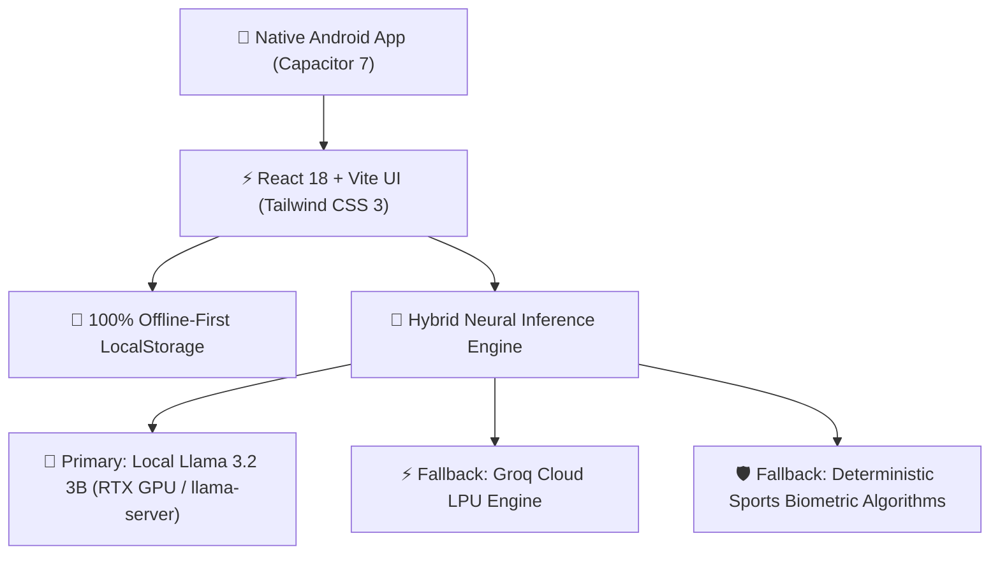
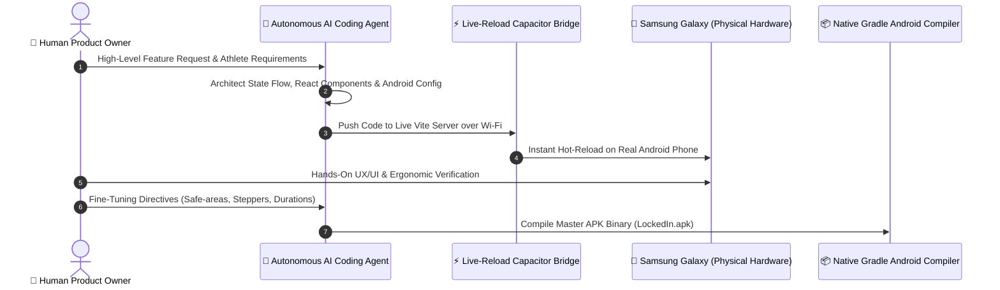

# 🏆 LockedIn — Company Presentation Poster & Pitch Deck

---

## 📌 Executive Summary
**LockedIn** is a high-performance Athletic Operating System combining **Precision Nutrition Architecture**, **Pro Gym Tracking (Strong/Hevy Grade)**, and **Local Neural AI Coaching (Llama 3.2 3B)**.

Designed for athletes and engineered with zero cloud API token costs, 100% on-device health privacy, and a responsive mobile experience.

---

## 🎨 Brand Identity & Slogan
* **Logo**: Solid Black Container with Ambient Fiery Glow, Radiant Orange-Gold Flame, and Interlocking Metallic Orange Padlock.
* **Slogan**: *"Stay locked in all the time with LockedIn 🔒🔥"*
* **Tagline**: *Precision Nutrition Architecture • Gym Performance Logger • On-Device AI Intelligence*

---

## ⚙️ Full-Stack Architecture


| Layer | Technology | Key Benefit |
| :--- | :--- | :--- |
| **Mobile Shell** | **Capacitor 7 Android** | Native APK distribution, hardware safe-area insets, fluid performance. |
| **Frontend Framework** | **React 18 + Vite** | Instant hot-reload, sub-50ms tab transitions, modular components. |
| **Styling & Design System** | **Tailwind CSS 3** | Dark/Light athletic design system, responsive touch-target ergonomics. |
| **Local Neural AI** | **Llama 3.2 3B (NVIDIA RTX)** | Zero cloud subscription cost, sub-second response time, offline execution. |
| **Cloud AI Accelerator** | **Groq Cloud API** | Ultra-high-speed inference fallback when outside local network. |
| **Data Privacy** | **Offline LocalStorage** | Athlete health biometrics never leave the device (GDPR/HIPAA aligned). |

---

## 🤖 The AI-Agentic Development Workflow (How We Built It)



1. **Autonomous Agentic Coding**: AI agents generated full-stack components, biometric formulas, and native Android wrappers in rapid iteration cycles.
2. **Wi-Fi Live Hardware Hot-Reload**: Real-time sync over Wi-Fi to a physical Samsung Galaxy phone, testing UI responsiveness instantly.
3. **Rigorous Human Verification**: Hands-on validation of touch targets, keyboard friction, camera notch safe-areas, and workout logging flow.
4. **Automated Gradle Native Build**: Instant compilation into standalone `.apk` binaries with custom launcher icons and zero white splash artifacts.

---

## 🌟 Core Product Pillars

```carousel
### 🥑 1. Precision Nutrition & Diet Architect
- Automated caloric budget calibrated to athlete gender, height, weight, and training goal.
- Dynamic Macro balance (Protein / Carbs / Fats).
- 1-Tap Quick Food / Snack Logger.
- AI Craving & Recipe Architect (generates custom meals from ingredients you have).
<!-- slide -->
### 🏋️ 2. Active Gym Tracker (Strong / Hevy Grade)
- Zero typing friction: 1-tap `±2.5kg` weight & `±1 rep` steppers.
- Automatic rest countdown timer.
- Carry-forward weights across consecutive sets.
- Manual duration adjustments (`30m, 45m, 60m, 75m, 90m` chips and `±5m` steppers).
- "+ Log Past Workout" option for sessions without a phone.
<!-- slide -->
### 🤖 3. Coach Lock Neural AI Assistant
- Tailored multi-sport intelligence (Football, Tennis, Basketball, MMA, Strength).
- Context-aware daily feedback based on logged meals and workouts.
- Powered by local Llama 3.2 3B GPU neural engine.
<!-- slide -->
### 🏆 4. 100% LockedIn Daily Quests
- Gamified daily missions: Workout Done + Calorie Target Met + Nutrition Tracked.
- Emerald & Gold completion HUD with celebratory feedback.
```

---

## 📂 Exported Presentation Artifacts
The following presentation files are saved directly in your **`~/Documents`** folder:

* 📄 [**`LockedIn_Company_Presentation_Poster.pdf`**](file:///home/yaruno/Documents/LockedIn_Company_Presentation_Poster.pdf) *(Print-ready Presentation Poster PDF)*
* 🖼️ [**`LockedIn_Company_Presentation_Poster.png`**](file:///home/yaruno/Documents/LockedIn_Company_Presentation_Poster.png) *(Ultra-HD 4K Infographic Image)*
* 🌐 [**`LockedIn_Company_Presentation_Poster.html`**](file:///home/yaruno/Documents/LockedIn_Company_Presentation_Poster.html) *(Interactive Responsive Poster Webpage)*
* 🎨 [**`LockedIn_AI_Concept_Poster.jpg`**](file:///home/yaruno/Documents/LockedIn_AI_Concept_Poster.jpg) *(8K Conceptual AI Visual Render)*
* 📱 [**`LockedIn.apk`**](file:///home/yaruno/Documents/LockedIn.apk) *(Production Android Binary - 4.3 MB)*
